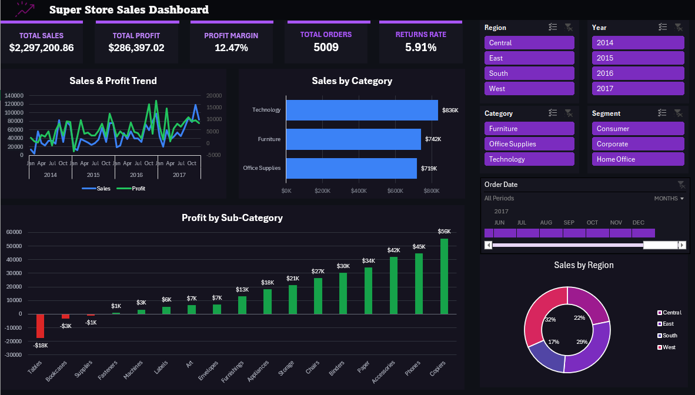

# Super Store Sales Dashboard

An interactive Microsoft Excel dashboard for exploring Super Store performance between 2014 and 2017. The project turns order, return, and regional management data into a compact decision-making view built with PivotTables, PivotCharts, slicers, and a timeline.

## Demo video

[Watch the interactive dashboard demo](super-store-dashboard-demo.mp4)

## Dashboard highlights

- Executive KPIs for total sales, total profit, profit margin, total orders, and return rate.
- Monthly sales and profit trend analysis.
- Sales comparison across the Furniture, Office Supplies, and Technology categories.
- Profit breakdown by product sub-category.
- Regional sales distribution.
- Interactive filters for region, year, category, segment, and order date.

## Key results

| Metric | Value |
| --- | ---: |
| Total sales | $2,297,200.86 |
| Total profit | $286,397.02 |
| Profit margin | 12.47% |
| Total orders | 5,009 |
| Return rate | 5.91% |

## Workbook structure

| Worksheet | Purpose |
| --- | --- |
| `Dashboard` | Interactive executive summary and visual analysis |
| `Orders` | Order-level source data |
| `Orders Pivot Tables` | PivotTables that power the dashboard visuals and KPIs |
| `Returns` | Returned-order records |
| `Manager` | Regional manager reference data |

## Technical details

- Microsoft Excel
- 9,994 order records
- 3 structured Excel tables
- 26 PivotTables
- 4 PivotCharts
- 5 slicers, plus an order-date timeline
- No macros or external workbook links

## How to use

1. Download [Super-Store-Sales-Dashboard.xlsx](Super-Store-Sales-Dashboard.xlsx).
2. Open it in Microsoft Excel for the best interactive experience.
3. Select the `Dashboard` worksheet.
4. Use the slicers and timeline to filter the KPIs and charts.
5. Clear a filter from its slicer header to return to the complete view.

> PivotTables, slicers, and the timeline may have limited interactivity in browser previews. Open the downloaded workbook in Microsoft Excel to use every feature.

## Skills demonstrated

Data cleaning and organization, Excel Tables, PivotTables, PivotCharts, dashboard design, KPI reporting, time-series analysis, segmentation, and interactive filtering.

## Data note

This project uses the commonly available Super Store practice dataset for educational analysis. The workbook is included as a portfolio demonstration of Excel analysis and dashboard-building skills.
